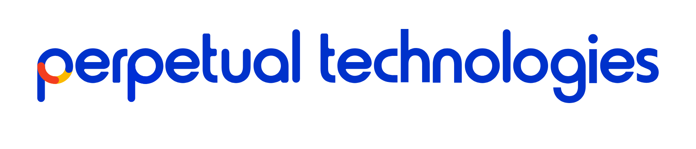

# Perpetual Design System 2 — Template de presentación

Plantilla de presentación (`.pptx`, 16:9) construida con el **design system de Perpetual Technologies**. Reinterpreta el layout del template "Essentials" con la marca Perpetual: colores oficiales, tipografía **Armin Grotesk**, logos correctos por contraste y las reglas duras de marca (nada de negro puro, fondos oscuros en `#0b1220`, logo nunca recoloreado).

## Entregable

- **`dist/perpetual-deck-template.pptx`** — 19 slides on-brand, listas para editar en PowerPoint o Keynote.

## Las 19 slides

| # | Slide | # | Slide |
|---|---|---|---|
| 1 | Portada (hero + line chart) | 11 | Estadísticas de redes |
| 2 | Statement | 12 | Matrix / honeycomb |
| 3 | Crecimiento de mercado | 13 | Desempeño mensual |
| 4 | Trayectoria (timeline) | 14 | Pricing (3 planes) |
| 5 | Automatización a medida | 15 | Equipo |
| 6 | Comunidad (barras + burbujas) | 16 | Roadmap |
| 7 | Break section (oscura) | 17 | Nueva misión |
| 8 | Cobertura regional | 18 | Branding 101 |
| 9 | Métricas (donut) | 19 | Infografía 3D (6 pasos) |
| 10 | Proyección de usuarios | | |

## Marca aplicada

- **Color:** acento azul `#1a56db` + naranja `#f97316`. Secciones oscuras en `#0b1220` (nunca negro puro). Brand primitives del logo intactos.
- **Tipografía:** Armin Grotesk en sus pesos (Black para titulares y números, SemiBold para labels, Regular/Normal para cuerpo).
- **Logo:** versión color en fondos claros, versión dark en fondos oscuros. Embebido como imagen fiel, sin recolorear ni distorsionar.
- **Charts:** nativos de PowerPoint (línea, columnas, donut) con la paleta de datos del design system. Editables.
- **Ilustraciones complejas** (engranaje, mapa, honeycomb, roadmap, bloques 3D): reinterpretaciones limpias con shapes nativos, no copias del mockup original.

> Fuente de verdad de los tokens: repo [`perpetual-design-system-general`](https://github.com/hector-perpetual/perpetual-design-system-general).

## Logos

Dos variantes oficiales. Se elige por **contraste del fondo**, no por preferencia.

**Color** (`perpetual-color.svg`) — fondos claros. Wordmark azul `#0032cb` + ícono naranja/amarillo.



**Dark** (`perpetual-dark.svg`) — fondos oscuros (`#0b1220`, portadas dark, fotos). Wordmark blanco, el ícono naranja/amarillo se mantiene.


> La versión dark es blanca, así que sobre fondo blanco se ve invisible: es lo esperado, no un error. Por eso arriba se muestra sobre su fondo oscuro. Los archivos `.png`/`.svg` originales son **transparentes** para poder colocarlos sobre cualquier fondo; las imágenes `*-preview.png` solo existen para documentación.
>
> Nunca recolorear, distorsionar, ni poner sombra/contorno al logo (regla dura de marca).

## Tipografía

El deck referencia **Armin Grotesk** por nombre. Las 5 variantes OTF están en `assets/fonts/`. Si la fuente no está instalada en tu equipo, instálala primero (doble clic en cada `.otf`) para que el deck se vea correcto. Para un archivo 100% portable, en PowerPoint usa `Archivo › Opciones › Guardar › Incrustar fuentes en el archivo`.

## Regenerar el deck

Requiere Python 3 con `python-pptx`:

```bash
pip install python-pptx
python build.py
```

Esto reconstruye `dist/perpetual-deck-template.pptx` de forma reproducible. Los logos PNG en `assets/logo/` se rasterizan desde los SVG oficiales del design system.

## Estructura

```
perpetual-design-system-2/
├── build.py          # generador del deck (python-pptx)
├── brand/            # marca completa (autosuficiente)
│   ├── SKILL.md      # tokens + índice (fuente de verdad)
│   └── references/   # tokens.md, components.md, voice-and-rules.md
├── assets/
│   ├── logo/         # perpetual-color / perpetual-dark (SVG + PNG + previews)
│   └── fonts/        # Armin Grotesk (5 OTF)
└── dist/             # perpetual-deck-template.pptx
```

## Repo autosuficiente

Este repo contiene **todo lo necesario** para trabajar on-brand sin pegar nada a mano: tokens y reglas (`brand/`), tipografía (`assets/fonts/`), logos (`assets/logo/`) y el template (`dist/`). Conectar solo este repositorio de GitHub basta para que una herramienta o agente jale la marca completa de forma automática.
