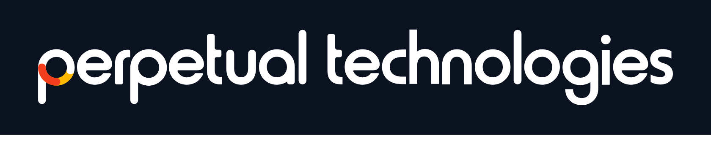

# Perpetual Design System

Repo **único y canónico** de la marca Perpetual Technologies: tokens, tipografía **Armin Grotesk**, logos, reglas de marca y un template de presentación on-brand. Conectar solo este repositorio basta para que una herramienta o agente jale la marca completa.

## Contenido

| Carpeta | Qué es |
|---|---|
| `perpetual-design-system/` | El design system (fuente de verdad): `SKILL.md`, `references/` (tokens, componentes, voz/reglas) y `assets/` (logos + fuentes). |
| `dist/perpetual-design-system.skill` | Skill empaquetada, lista para instalar. |
| `dist/perpetual-deck-template.pptx` | Template de presentación, 19 slides on-brand. |
| `build.py` | Generador reproducible del deck (python-pptx). |
| `report/perpetual-ai-at-work.html` | Reporte-infografía HTML autocontenido (estilo informe de consultoría) en marca Perpetual. Se abre en el navegador. |
| `report/build_report.py` | Generador del reporte HTML (fuentes embebidas + logo inline). |

## Template de presentación (19 slides)

Reinterpreta el layout "Essentials" con la marca Perpetual.

| # | Slide | # | Slide |
|---|---|---|---|
| 1 | Portada (hero + line chart) | 11 | Estadísticas de redes |
| 2 | Statement | 12 | Matrix / honeycomb |
| 3 | Crecimiento de mercado | 13 | Desempeño mensual |
| 4 | Trayectoria (timeline) | 14 | Pricing (3 planes) |
| 5 | Automatización a medida | 15 | Equipo |
| 6 | Comunidad (barras + burbujas) | 16 | Roadmap |
| 7 | Break section (oscura) | 17 | Nueva misión |
| 8 | Cobertura regional | 18 | Branding 101 |
| 9 | Métricas (donut) | 19 | Infografía 3D (6 pasos) |
| 10 | Proyección de usuarios | | |

## Marca aplicada

- **Color:** acento azul `#1a56db` + naranja `#f97316`. Secciones oscuras en `#0b1220` (nunca negro puro). Brand primitives del logo intactos.
- **Tipografía:** Armin Grotesk en sus pesos (Black para titulares y números, SemiBold para labels, Regular/Normal para cuerpo).
- **Logo:** versión color en fondos claros, versión dark en fondos oscuros. Embebido como imagen fiel, sin recolorear ni distorsionar.
- **Charts:** nativos de PowerPoint (línea, columnas, donut) con la paleta de datos del design system. Editables.
- **Ilustraciones complejas** (engranaje, mapa, honeycomb, roadmap, bloques 3D): reinterpretaciones limpias con shapes nativos, no copias del mockup original.

## Logos

Dos variantes oficiales. Se elige por **contraste del fondo**, no por preferencia.

**Color** (`perpetual-color.svg`) — fondos claros. Wordmark azul `#0032cb` + ícono naranja/amarillo.


**Dark** (`perpetual-dark.svg`) — fondos oscuros (`#0b1220`, portadas dark, fotos). Wordmark blanco, el ícono naranja/amarillo se mantiene.



> La versión dark es blanca, así que sobre fondo blanco se ve invisible: es lo esperado, no un error. Por eso arriba se muestra sobre su fondo oscuro. Los `.svg`/`.png` originales son **transparentes** para colocarlos sobre cualquier fondo; las imágenes `*-preview.png` solo existen para documentación.
>
> Nunca recolorear, distorsionar, ni poner sombra/contorno al logo (regla dura de marca).

## Tipografía

**Armin Grotesk** es la única tipografía de marca. En `perpetual-design-system/assets/fonts/` están las 5 variantes en dos formatos: `.b64` (base64, formato canónico de la skill para web) y `.otf` (para instalar o incrustar). Si no la tienes instalada, doble clic en cada `.otf`. Para un `.pptx` 100% portable: en PowerPoint, `Archivo › Opciones › Guardar › Incrustar fuentes en el archivo`.

## Regenerar el deck

```bash
pip install python-pptx
python build.py
```

Reconstruye `dist/perpetual-deck-template.pptx` de forma reproducible. Los logos PNG se rasterizan desde los SVG oficiales.

## Estructura

```
perpetual-design-system-2/
├── build.py                              # generador del deck (python-pptx)
├── perpetual-design-system/              # design system (fuente de verdad)
│   ├── SKILL.md                          # tokens + índice
│   ├── references/                       # tokens.md, components.md, voice-and-rules.md
│   └── assets/
│       ├── logo/                         # color / dark (SVG + PNG + previews)
│       └── fonts/                        # Armin Grotesk (5× .b64 + 5× .otf)
└── dist/
    ├── perpetual-design-system.skill     # skill empaquetada
    └── perpetual-deck-template.pptx       # template de presentación
```
